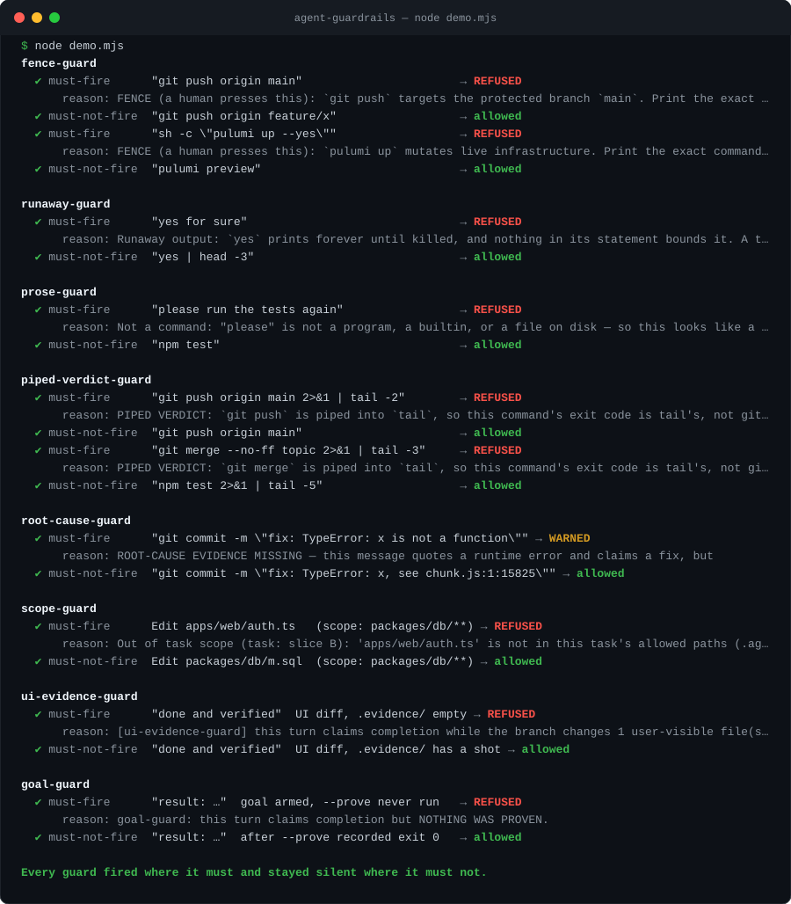
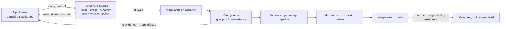

# agent-guardrails

**Deterministic guard hooks for Claude Code that let a coding agent run unattended without lying,
looping, filling a disk, or pressing the one button that cannot be un-pressed.**

[](https://github.com/bram-wq/agent-guardrails/actions/workflows/test.yml)
  

Ten hooks (eight lifted from production, two built from a survey of the field), 1,712 test cases, zero dependencies, one-command install and uninstall.
Every guard has a must-fire test (the incident, verbatim) and a must-not-fire test (its legitimate
twin), because a guard that blocks real work gets switched off within a week. The test total on this
page is printed by the runner, not typed.



## Try it in 60 seconds, no clone

```bash
npx github:bram-wq/agent-guardrails#v0.4.0 try 'git push origin main 2>&1 | tail -2'
npx github:bram-wq/agent-guardrails#v0.4.0 try 'yes for sure'
npx github:bram-wq/agent-guardrails#v0.4.0 demo
```

`try` feeds a shell command through every Bash guard exactly as Claude Code would and prints each
verdict. Pin the tag; an unpinned `github:` install tracks whatever is on `main` today.

## Install

```bash
npx github:bram-wq/agent-guardrails#v0.4.0 init       # copies hooks/ into ./.claude/hooks/, merges settings.json (backup first)
npx github:bram-wq/agent-guardrails#v0.4.0 doctor     # each hook allows a benign event of its own type AND refuses its incident
npx github:bram-wq/agent-guardrails#v0.4.0 report     # runs / fires / rate per hook for THIS project, with the denominator
npx github:bram-wq/agent-guardrails#v0.4.0 uninstall  # removes only what init added; a hook you modified is kept and named
```

`init` is idempotent, never clobbers a hook you already have, and installs nothing into
`node_modules`: the hooks are plain files you own from then on. `--user` targets `~/.claude`,
`--dry-run` prints the plan and writes nothing. Adoption, day by day: [`docs/ADOPT.md`](docs/ADOPT.md).

### Codex

```bash
npx github:bram-wq/agent-guardrails init --agent codex           # hooks into ./.codex/hooks/ (+ the adapter), entries into ./.codex/hooks.json
npx github:bram-wq/agent-guardrails try --agent codex 'git push origin main 2>&1 | tail -2'   # same table, through the adapter
```

Covered under OpenAI Codex CLI: every Bash guard on `PreToolUse`, the three file guards on
`apply_patch` (split per file), and the Stop, SessionStart and PreCompact guards — same verdicts,
Codex's own deny shape. `.codex/hooks/`, `.codex/hooks.json` and `.codex/config.toml` are part of
config-tamper-guard's surface. A patch with no recognisable file header is refused, not passed
unjudged. Not covered: `doctor`. Every fact relied on, with its source and date: [`docs/CODEX.md`](docs/CODEX.md).

## The hooks

| Hook | Event | Refuses | Knobs |
|---|---|---|---|
| `fence-guard` | PreToolUse · Bash | Irreversible or outward-facing actions: push to a protected branch, force push, forge merges, history rewrites, `rm -rf` at a root, destructive SQL statements, `terraform apply` / `pulumi up` / `kubectl delete`, secret writes, package and image publishing, host destruction. Sees through quotes, heredocs, `$(…)`, `sh -c`, `sudo`, env prefixes. A human runs these in their own terminal. | `FENCE_PROTECTED_BRANCHES` (default `main,master`), `FENCE_EXTRA`, `FENCE_ALLOW` (logged as `exempted`). No kill switch by design. |
| `goal-guard` | SessionStart · Stop | Ending a turn with a completion claim (`result:`, `DONE`, `Done.`, `verified complete`, …) while the armed goal's DONE command has never been recorded exiting 0. `--set` an objective with a `--done` command; `--prove` runs it and stamps the real exit code; SessionStart re-injects the goal so it survives `/clear` and compaction. State is keyed per git worktree. The DONE command must be a read-only verification shape inside the worktree. | `HOOK_STATE_DIR`, `GOAL_GUARD_ALLOW_NPM_SCRIPTS` (a literal list of extra script names; the denylist still applies) |
| `prose-guard` | PreToolUse · Bash | A "command" whose first verb resolves to no program, builtin, or file: a sentence meant for the assistant that reached the shell. Deterministic PATH lookup against the event's `cwd`, not a grammar heuristic. | `PROSE_GUARD_ALLOW` (regex for shell functions and aliases the hook cannot see), `CLAUDE_HOOKS_QUIET=1` |
| `runaway-guard` | PreToolUse · Bash | Generators with no natural stop (`yes`, `cat /dev/urandom`, `seq inf`, `while true`) unless something in the **same pipeline** bounds them (`\| head`, `timeout`, `-c N`). Evaluated per statement, so a bound in one statement cannot excuse the next. | — |
| `piped-verdict-guard` | PreToolUse · Bash | `git push` / `merge` / `rebase` piped into a pure output filter with no `${PIPESTATUS[0]}` read in the next statement and no `pipefail` in force: the shape that reports a blocked push as a clean one. Scope was narrowed against a ~6,000-command transcript corpus to the three verbs where a masked verdict caused damage. | `CLAUDE_HOOKS_QUIET=1` |
| `scope-guard` | PreToolUse · Edit/Write/MultiEdit | An edit outside the path globs a task declared in `.agent-scope` (opt-in; `deny` beats `allow`). Resolves symlinks, fails closed on a malformed scope file, refuses a scope edit that widens itself, and compiles globs linearly so a deep path cannot time the hook out. | `.agent-scope` |
| `ui-evidence-guard` | Stop | A turn that claims UI work is done while the branch diff touches user-visible files and `.evidence/` holds no real screenshot (image magic bytes, > 5 KB) newer than the newest UI commit. Anchors to content author-time so rebases and branch splits cannot manufacture or destroy evidence. | `UI_EVIDENCE_PATHS` (regex of your UI paths) |
| `secret-write-guard` | PreToolUse · Write/Edit/MultiEdit/NotebookEdit/Bash | A write whose **text** carries a credential: 14 vendor shapes (AWS, GitHub, GitLab, Slack, Stripe, Google, PEM private keys, npm, Anthropic, OpenAI, Twilio, SendGrid, Discord, JWT) plus `key/secret/token/password = <high-entropy value>`. For Bash only the parts that write: heredoc bodies, `> file`, `tee`, `sed -i`, `sh -c` strings. The reason names the rule id and file:line, never the value. Placeholders, git SHAs, UUIDs, fixtures and read-only commands pass. Rules are a gitleaks-shaped JSON file you can extend. | `SECRET_GUARD_ALLOW_PATHS`, `SECRET_GUARD_RULES`, `CLAUDE_HOOKS_QUIET=1` |
| `config-tamper-guard` | PreToolUse · Write/Edit/MultiEdit/NotebookEdit/Bash · SessionStart | Any write to the agent's own control surface: `.claude/settings*.json`, `.claude/hooks/`, `.agent-scope`, `.mcp.json`, `.git/hooks/`, `core.hooksPath`, the managed-settings directories. Sees redirects, `tee`, `sed -i`, `cp`/`mv`/`ln` destinations, `chmod`, `sh -c`, `$(…)`. Reads, hook invocations and `.claude/skills|commands|agents` pass. SessionStart prints a fingerprint of the surface so tampering shows as a changed digest. | `CONFIG_GUARD_ALLOW=1` in the environment that launched Claude Code (a prefix inside the command is stripped and does not count). Not lifted by `CLAUDE_HOOKS_QUIET`. |
| `precompact-handoff` | PreCompact | Nothing. Before a compaction it writes a durable handoff (goal, DONE command, proven or not, the last ten refusals, timestamp) under the state dir, so the summary cannot lose them; goal-guard's SessionStart re-injects the goal after the compaction. Never blocks. | `HOOK_STATE_DIR`, `HOOK_FIRE_LOG` |
| `root-cause-guard` | PreToolUse · Bash (warn only) | A commit or PR message that quotes a runtime error and claims a fix while naming no stack frame, artifact offset, or query count. Warns through `additionalContext`, the channel Claude actually reads; never blocks. | — |

Every guard: decides in milliseconds from the event alone, fails **open** on its own bugs (a guard
that bricks a session gets switched off, which is worse than no guard), fails **closed** on input too
large to scan, prints a reason that carries the fix, and records that it ran and whether it fired.
Per-guard fields and stdout shapes, verified against the hooks reference on 2026-09-12:
[`docs/COMPAT.md`](docs/COMPAT.md). Cost per call, measured: [`docs/BENCH.md`](docs/BENCH.md).

**The layer above.** `managed-settings.example.json` is a permissions deny floor for the fence class plus
`disableBypassPermissionsMode`, using only keys the settings reference confirms; put it in the managed
settings path and the hooks become the second layer, not the only one.

**What these do not do.** They run as your user, from files the agent can edit. They stop an agent
from making a class of mistakes silently; they do not stop an agent that wants to bypass them. A
PreToolUse hook that times out allows the call. The full list of accepted bypasses, with reasons:
[`docs/THREAT-MODEL.md`](docs/THREAT-MODEL.md).

## Why this and not another hook set

Read on 2026-09-12; star counts from that day. The others are good; pick by what you need.

| If you need | Use | Because |
|---|---|---|
| The same command analyzer across Codex, Cursor, Gemini, Copilot and nine more harnesses | [claude-code-safety-net](https://github.com/kenryu42/claude-code-safety-net) (1.5k stars) | Breadth is its design goal. This repo targets Claude Code's hook contract only, and says so. |
| A plugin-marketplace bundle of everyday hooks (dangerous commands, protect tests, config guard) | [claude-code-hooks](https://github.com/karanb192/claude-code-hooks) (509 stars) | A wider grab bag. This repo ships fewer guards, each with the incident that produced it. |
| A gitleaks engine with output redaction and CI integration | [agent-guard](https://github.com/JeongJaeSoon/agent-guard) | It wraps the real gitleaks binary. `secret-write-guard` here vendors 15 rules as JSON with no binary and no dependency. |
| A real boundary against an agent that wants out | [`@anthropic-ai/sandbox-runtime`](https://github.com/anthropic-experimental/sandbox-runtime) (5.2k stars), managed settings, a separate identity | Hooks run as your user from files the agent can edit. Anthropic's own layering is managed settings, then deny rules, then a sandbox, then hooks. `managed-settings.example.json` here is the layer above. |
| A guard that judges with a model (`prompt` or `agent` hook types, TDD Guard, NeMo) | Not here, by design | A model verdict cannot have a must-fire test, its 30-second timeout fails open, and every false positive on a busy day is an interrupt. Every guard here decides in milliseconds from the event alone. |

What this repo has that the others do not, as far as the survey found:

- **Stop-side guards.** `goal-guard` refuses "done" until the stopping command has exited 0.
  `ui-evidence-guard` refuses "done" on a UI branch with no rendered screenshot. The other sets guard
  what the agent *runs*; these two guard what it *claims*.
- **The incident, verbatim, as the must-fire test, and its legitimate twin as the must-not-fire test.**
  1,712 cases across ten guards and the Codex adapter, printed by the runner. Mutation-tested by hand: each guard's deny branch
  was removed and the suite went red.
- **Fire logs with denominators.** `report` prints runs, fires and rate per hook per project, so a guard
  is pruned on a count, never on an opinion. `piped-verdict-guard` was narrowed from every piped command
  to three git verbs on ~6,000 logged commands.
- **A production origin.** These ran on a plane landing 76 merges a day with no human in the merge loop.
  The numbers are dated and the method is in the write-up.

### Start with goal-guard

The Stop hook that refuses "done" without a command and its output is the one that changes everything
downstream. `init` wires it; then:

```sh
node .claude/hooks/goal-guard.mjs --set "the flaky suite passes 3 runs in a row" --done "npm test"
node .claude/hooks/goal-guard.mjs --prove     # runs `npm test`, records the real exit code
node .claude/hooks/goal-guard.mjs --status    # exit 0 = proven · --clear when the goal is met
```

With no goal set the hook never fires; setting a goal is the act that arms it.

## Write your own

```bash
npx github:bram-wq/agent-guardrails#v0.4.0 new my-guard   # hooks/my-guard.mjs + hooks/my-guard.test.mjs, tests pre-written in pairs
```

The scaffold carries the contract so you cannot get it wrong by accident: parse inside a try that
fails open, a byte cap that fails closed, one stdout write, a natural exit (a `process.exit` after the
write can truncate a deny into an allow on Windows), telemetry, and MUST FIRE / MUST NOT FIRE / garbage
/ oversize / wrong-tool cases. The full contract: [`docs/writing-a-guard.md`](docs/writing-a-guard.md).

## Run the tests

```sh
node test.mjs                      # every suite, plain Node, no install; prints the case total the README quotes
node hooks/fence-guard.test.mjs    # one suite
node scripts/bench.mjs             # p50/p95 per hook against bare Node startup
```

CI runs the suite, the demo and a dry-run install on ubuntu, macOS and Windows, Node 20 and 22.
Requires Node 20+ and `git` on PATH (for the real-repo cases).

## Where these ran

Extracted from an engineering operation where several model families work in parallel git worktrees
on one TypeScript monorepo and a fail-closed pre-merge pipeline decides what lands. Numbers from that
system as measured on 2026-09-12; they describe the origin, not this repo:

| | |
|---|---|
| Guard hooks in production | 50 (48 with paired tests); eight of the ten here are the most portable of them |
| CI gate scripts | 340, each with its own test |
| Merges landed with no human in the merge loop | 2,276 |
| Merged changes per day | 76 on average, 125 on the peak day, at about USD 1.30 of CI each, attributed per merge |
| Architecture decision records | 53 |



The seven rules behind all of it: [`docs/DOCTRINE.md`](docs/DOCTRINE.md). How the stack was built,
with the three incidents that shaped it: [`docs/running-agents-unattended.md`](docs/running-agents-unattended.md).

## Contributing

A new guard is welcome when it comes from a measured failure and lands with both tests. Open an issue
with the [guard proposal template](.github/ISSUE_TEMPLATE/guard-proposal.md), or run `new` and send
the pair. See [`CONTRIBUTING.md`](CONTRIBUTING.md) and [`SECURITY.md`](SECURITY.md). MIT.
