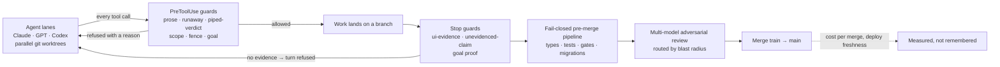

# agent-guardrails

**Deterministic guard hooks that let coding agents (Claude Code, Codex) run unattended without lying,
looping, or filling a disk.**

[](https://github.com/bram-wq/agent-guardrails/actions/workflows/test.yml)
  

Seven production hooks, 337 test cases, zero dependencies. Every guard has a
must-fire test (the incident, verbatim) and a must-not-fire test (its legitimate twin), because a guard
that blocks real work gets switched off within a week.


## Install in 30 seconds

```bash
npx github:bram-wq/agent-guardrails init      # copies hooks/ into ./.claude/hooks/, merges settings.json (backup first)
npx github:bram-wq/agent-guardrails doctor    # every installed hook parses and answers the stdin contract
npx github:bram-wq/agent-guardrails report    # per-hook runs / fires / fire-rate, with the denominator
```

`init` is idempotent and never clobbers hooks you already have; add `--user` to target `~/.claude`
instead of the project, `--dry-run` to see the plan and write nothing. Nothing is installed into
`node_modules` — the hooks are plain files you own from then on.

| command | does |
|---|---|
| `init [--user] [--dry-run]` | copy `hooks/*.mjs`, merge the `hooks` block from [`settings.example.json`](settings.example.json) into `settings.json` after writing a timestamped backup |
| `doctor [--user]` | Node ≥ 20; each hook parses and exits 0 on a benign event; every path `settings.json` references exists |
| `report` | table from the fire log: runs, fires, rate per hook — and `never ran` kept distinct from `ran, never fired` |
| `demo` | runs `demo.mjs` |

### The one to start with: goal-guard

The write-up says to begin with the Stop hook that refuses "done" without a command and its output.
This is that hook. `init` wires it; by hand:

```json
"SessionStart": [{ "hooks": [{ "type": "command", "command": "node",
  "args": ["${CLAUDE_PROJECT_DIR}/.claude/hooks/goal-guard.mjs"], "timeout": 10 }] }],
"Stop":         [{ "hooks": [{ "type": "command", "command": "node",
  "args": ["${CLAUDE_PROJECT_DIR}/.claude/hooks/goal-guard.mjs"], "timeout": 15 }] }]
```

```sh
node .claude/hooks/goal-guard.mjs --set "the flaky suite passes 3 runs in a row" --done "npm test"
node .claude/hooks/goal-guard.mjs --prove     # runs `npm test`, records the real exit code; Stop blocks a completion claim until it is 0
node .claude/hooks/goal-guard.mjs --status    # exit 0 = proven · --clear when the goal is met
```

State lives in `$XDG_STATE_HOME/claude-hooks/goals/<worktree>/` (override: `HOOK_STATE_DIR`). With no goal
set the hook never fires; setting a goal is the act that arms it.

## 60-second demo

```bash
git clone https://github.com/bram-wq/agent-guardrails && cd agent-guardrails
node demo.mjs      # feeds each guard the JSON Claude Code sends a hook, twice: the bad command and its twin
npm test           # 337 cases across seven suites plus the CLI, plain Node, no install step
```

```
runaway-guard
  ✔ must-fire      "yes for sure"            → REFUSED   (a two-word answer that reached the shell once wrote 5 GB)
  ✔ must-not-fire  "yes | head -3"           → allowed   (the bound is the whole distinction)
prose-guard
  ✔ must-fire      "please run the tests"    → REFUSED   ("please" is not a program, builtin, or file)
  ✔ must-not-fire  "npm test"                → allowed
piped-verdict-guard
  ✔ must-fire      "git push … | tail -2"    → REFUSED   (the exit code you would read is tail's, not git's)
  ✔ must-not-fire  "npm test … | tail -5"    → allowed   (local verdicts were removed from scope after telemetry
                                                           showed thousands of runs for a dozen fires)
```

## Where these ran

These hooks come from an engineering operation where several model families work in parallel git
worktrees on one TypeScript monorepo, and a fail-closed pre-merge pipeline decides what lands. Numbers
from that system, as measured in September 2026:

| | |
|---|---|
| Guard hooks in production | 50 (48 with paired tests); these seven are the most portable |
| CI gate scripts | 340, each with its own test |
| Merges landed with no human in the merge loop | 2,180+ |
| Merged changes per day at peak | 83, at USD 1.15 of CI cost each, attributed per merge |
| Architecture decision records | 47 |



The doctrine behind all of it is in [`docs/DOCTRINE.md`](docs/DOCTRINE.md). The seven rules fit on one page.

---

## Details

Seven deterministic [Claude Code hooks](https://docs.anthropic.com/en/docs/claude-code/hooks) that
refuse unsafe or unevidenced agent actions, with the tests that keep them honest. Extracted from a
production agent fleet and sanitised; the logic and the tests are unchanged.

## What these are

A hook is a small Node script Claude Code runs at a lifecycle event. `PreToolUse` hooks receive
the tool call as JSON on stdin and may **deny** it (`permissionDecision: "deny"` on stdout);
`Stop` hooks receive the turn's final message and may **block** it, forcing another turn. Every
hook here is a pure, dependency-free `.mjs` file that:

- decides in milliseconds from the event alone (no LLM, no network, no state the agent can edit);
- **fails open** on its own bugs (a guard that bricks a session gets switched off, which is worse
  than no guard) but **fails closed** on oversize input it cannot scan;
- prints a deny reason that carries the fix, not just the refusal;
- records that it ran and that it fired (`_fire-log.mjs`), so "this guard never fires" is a
  measured claim with a denominator, never a guess.

## Doctrine

**If it can be a mechanism, it must not be a sentence.** Every hook here replaced a rule that had
been written down, read, agreed with, and then broken anyway. A guideline in a config file is
advice; a hook that refuses the tool call is a control. When the same correction recurs, the first
question is whether a script can make the wrong thing impossible.

**Every guard has a must-fire and a must-not-fire test.** A guard with only must-fire cases is a
guard that will be disabled the first week it blocks real work; a guard with only must-not-fire
cases proves nothing. Several tests below were added after mutation testing showed a passing
suite that could not fail (see `scope-guard.test.mjs`), and several must-not-fire cases are the
hook's *own remediation advice*, because a guard that refuses the command it recommends is the
worst false positive available.

## The hooks

| Hook | Event | Refuses |
|---|---|---|
| `prose-guard` | PreToolUse · Bash | A "command" whose first verb resolves to no program, builtin, or file — i.e. a sentence meant for the assistant that reached the shell. Deterministic PATH lookup, not a grammar heuristic. |
| `runaway-guard` | PreToolUse · Bash | Generators with no natural stop (`yes`, `cat /dev/urandom`, `seq inf`, `while true`) **unless** something bounds them (`\| head`, `timeout`, `-c N`). The bound is the whole distinction. |
| `piped-verdict-guard` | PreToolUse · Bash | `git push` / `merge` / `rebase` piped into a pure output filter (`\| tail`, `\| grep -v`) with no `${PIPESTATUS[0]}` in the very next statement and no `pipefail` in force — the shape that reports a blocked push as a clean one. Scope was narrowed against a ~6,000-command transcript corpus. |
| `root-cause-guard` | PreToolUse · Bash (warn only) | A commit or PR message that quotes a runtime error (`TypeError: …`) and claims a fix while naming no stack frame, artifact offset, or query count — a fix aimed by theory instead of by evidence. Prompts on stderr; never blocks. |
| `scope-guard` | PreToolUse · Edit/Write | An edit outside the path globs a task declared in `.agent-scope` (opt-in; `deny` beats `allow`). Resolves the governing worktree from the *target path*, so parallel lanes in sibling worktrees are actually enforced. |
| `ui-evidence-guard` | Stop | A turn that says "done / fixed / shipped" while the branch diff touches user-visible files and `.evidence/` holds no real screenshot (image type, > 5 KB) newer than the newest UI commit. Anchors to content author-time so rebases and branch splits cannot manufacture or destroy evidence. |
| `goal-guard` | SessionStart · Stop | A turn that asserts completion (a line opening with `result:`, `DONE`, `Done.` or `verified complete`) while the armed goal's stopping command has never been recorded exiting 0. Opt-in: `--set` an objective with a `--done` command; `--prove` runs that command and stamps the **real** exit code; SessionStart re-injects the goal so it survives `/clear`, resume and compaction. State is keyed per git worktree, so two parallel lanes cannot prove each other's goals. The stopping command must be a read-only verification shape (`npm test`, `npm run <test|lint|typecheck|check:*|verify:*|gate:*|ci:*>`, `node <file>.mjs`, `npx vitest`, composed only with `&&`), and a small denylist (`rm -rf`, `git push --force`, `DROP TABLE`, …) refuses the obviously destructive at both `--set` and `--prove`. |

Two helpers: `_fire-log.mjs` (run/fire telemetry, secret-safe by construction: it records a
source-authored `kind`, never the reason text) and `_scratch-dir.mjs` (self-reaping temp dirs for
the tests).

## Install (by hand)

`npx github:bram-wq/agent-guardrails init` does the following for you. To do it manually:
copy `hooks/*.mjs` into `.claude/hooks/` in your project and add the block from
[`settings.example.json`](settings.example.json) to `.claude/settings.json`. A minimal wiring for
two of them:

```json
{
  "hooks": {
    "PreToolUse": [
      {
        "matcher": "Bash",
        "hooks": [
          { "type": "command", "command": "node",
            "args": ["${CLAUDE_PROJECT_DIR}/.claude/hooks/piped-verdict-guard.mjs"], "timeout": 10 }
        ]
      }
    ],
    "Stop": [
      {
        "hooks": [
          { "type": "command", "command": "node",
            "args": ["${CLAUDE_PROJECT_DIR}/.claude/hooks/ui-evidence-guard.mjs"], "timeout": 15 }
        ]
      }
    ]
  }
}
```

Notes:

- `scope-guard` is inert until a `.agent-scope` file exists; `ui-evidence-guard` is inert on
  `main` and for branches that touch no path matching `UI_PATH_RE` (adjust that regex to your
  layout).
- `CLAUDE_HOOKS_QUIET=1` lifts `piped-verdict-guard` for a heads-down session; the tests strip
  the variable so it can never hide a green.
- Fire telemetry lands in `$XDG_STATE_HOME/claude-hooks/` (override with `HOOK_FIRE_LOG`), never
  in the repo, so a guard cannot dirty the working tree.
- In production the Bash guards run through a single runner process to amortise Node startup;
  the direct wiring above is simpler and correct, just a few tens of milliseconds slower per call.

## Run the tests

Plain Node, no framework — a hook must be verifiable by `node <file>` alone, because it runs where
no test runner exists. Requires Node 20+ and `git` on PATH (for `ui-evidence-guard`'s real-repo cases).

```sh
node test.mjs                              # every suite (hooks + CLI), stops on the first red; `npm test` is the same
node hooks/piped-verdict-guard.test.mjs    # one suite
```

CI runs `node test.mjs`, `node demo.mjs` and `node bin/agent-guardrails.mjs init --dry-run` on
ubuntu, macOS and Windows, Node 20 and 22.

Each suite prints one line per case, marked `FIRE`/`ALLOW` (or `MUST FIRE`/`MUST NOT FIRE`), and a
final summary line. The `piped-verdict-guard` suite also asserts a complexity budget: adversarial
60 KiB payloads must still deny and must run within 2x of a same-size benign command (best of five
samples, so scheduler noise cannot fail it while a quadratic path still would).

## Production context

These ran in a monorepo worked on by a fleet of coding agents from several model families,
each in its own git worktree, alongside human engineers. Merges were decided by a fail-closed
pipeline — a green verdict plus an independent multi-model review at the pinned head — with no
human "press" in the routine path. In that setting the expensive failures were never the
dramatic ones; they were quiet: a push reported as landed that never left the machine, a UI branch
merged on tests alone, a fix aimed at a plausible line of source while the crash lived in the
bundle, an agent editing a file two lanes over. Each hook here is one of those failures, measured
once, turned into a refusal, and pinned by a test in both directions.
